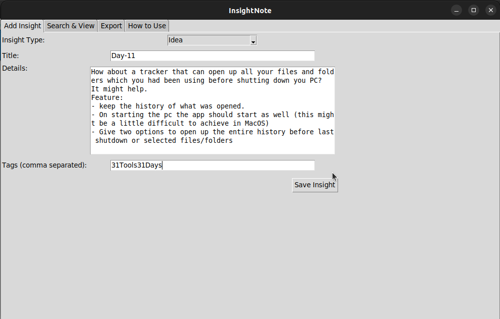
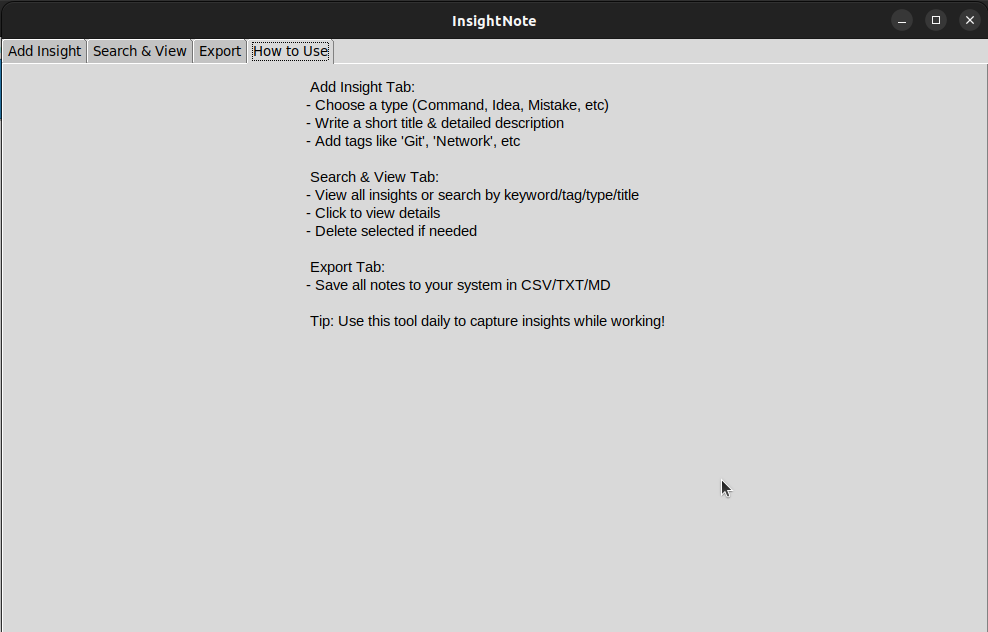
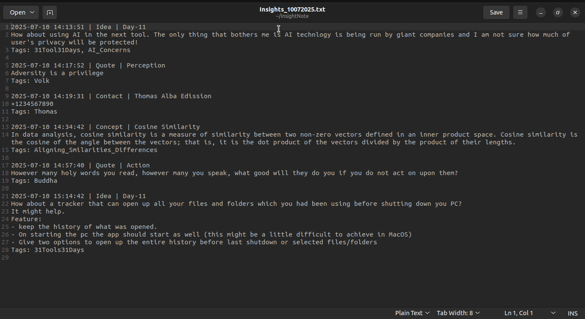
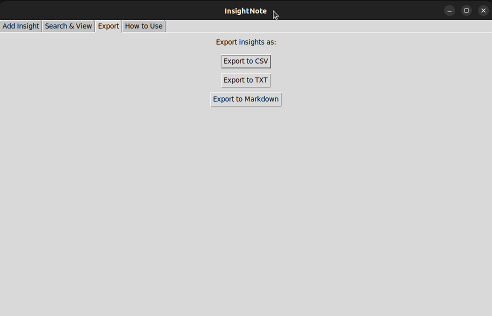

# 🧠 InsightNote - Capture Your Best Thinking, Instantly.

A cross-platform desktop app to **capture, organize, search, delete**, and **export your daily insights** in one place.

---

## 🚀 Why InsightNote?

Whether you're learning, building, debugging, or reading — ideas strike when you least expect.

**InsightNote** helps you:
- Quickly log useful commands, lessons, ideas, or fixes
- Categorize and tag them for easy retrieval
- Never lose an insight again due to system restarts or mental overload

> 💡 Think of it as your digital developer’s notepad — searchable, taggable, and exportable.

---

## 🧩 Features

### 🔹 Add Insight
- Choose insight type: `Command`, `Concept`, `Mistake`, `Quote`, `Contact`, `Idea`, `Fix`
- Add a short title, detailed description, and tags
- Timestamp is auto-added
- Data saved persistently to disk (`insights.json`)

### 🔎 Search & View
- Instant search across `Insight Type`, `Title`, `Details`, and `Tags`
- Click any insight to view full details
- Option to **delete** selected insights
- On launch, it shows your entire insight history (no need to search)

### 📤 Export
- One-click export of your entire insight database to:
  - `.csv` – for spreadsheet analysis
  - `.txt` – for simple plain text backup
  - `.md` – for Markdown journaling

### 📚 How to Use
- A dedicated **"How to Use"** tab with simple instructions
- No learning curve. Just open and type.

---

## 💻 Platform Support

Built with **Tkinter**, so works on:
- ✅ Windows (.exe)
- ✅ macOS (.dmg / .app)
- ✅ Linux (.AppImage)

---

## Screenshots

> 

> 

> 

> 

> 

## 🛠 Installation

### 1. Clone the repo:
```bash
git clone https://github.com/yourusername/InsightNote.git
cd InsightNote
